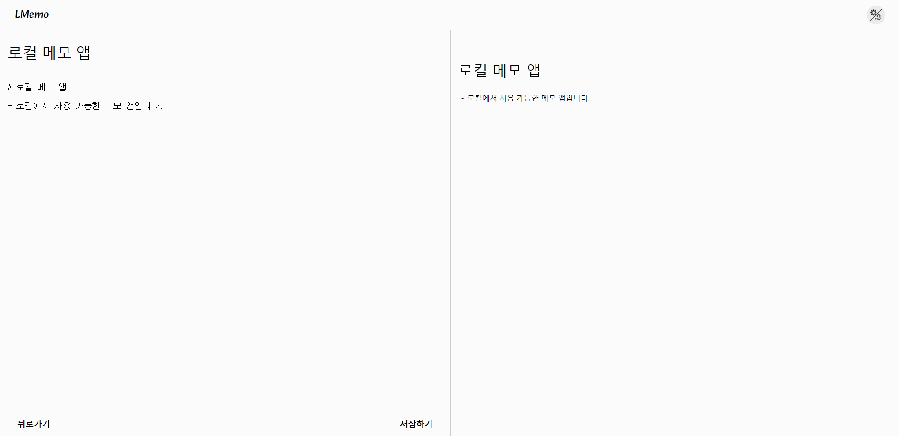

# L(ocal)Memo : 로컬 메모 앱

- React + Typescript + Recoil을 사용하여 메모를 작성하고 로컬스토리지에 저장하여 사용할 수 있는 웹페이지입니다. Typescript를 배우고 처음으로 만들어 본 웹페이지이며, 메모 CRUD 기능을 구현해보면서 Typescript 기술을 공부할 수 있었던 계기가 되었습니다.

 
 

## 사용 기술

- Typescript | React | Recoil | Styled-Components

 

## 배포

- 주소 : http://YouYou94.github.io/off-line-memo-app

 

## 프로젝트를 통해 배운점

- 초기 다크모드 기능 구현 당시 전역 상태 관리 라이브러리인 `Context API`를 사용하였습니다. 그러나 **Context API의 경우 Provider 하위에서 Context를 구독하는 모든 컴포넌트는 Provider의 Value prop이 변경될 때마다 불필요하게 렌더링이 발생**했습니다. 이러한 불필요한 렌더링은 성능 이슈가 있다는 것을 알게 되어 해당 단점을 보완한 `Recoil`로 변경하여 상태 관리를 하였습니다.
- 타입스크립트를 학습하여 처음 도입한 프로젝트입니다. 타입스크립트를 사용하면서 Button, Input의 onChange, onClick과 같은 이벤트 객체 타입에 대해 공부할 수 있는 계기가 되었습니다. 또한, **컴포넌트로 전달되는 prop에 타입을 지정해 줌으로써 해당 prop이 어떠한 역할을 하는지 미리 예측이 가능하여 에러를 사전에 방지할 수 있다는 장점**에 대해 직접 사용해보면서 알게 되었습니다.
- 자주 사용되는 마크다운 문법을 직접 구현해 보면서 문자열 검색 알고리즘에 대해 공부하였고, 복잡한 문자열에 대한 처리 능력을 향상시켰습니다. **초기에는 우직한(Naïve) 문자열 검색법**을 이용하여 문자열 하나하나를 비교하는 문자열 알고리즘을 사용하였습니다. 이후, 성능 향상을 위해 알고리즘 교체 중 **KMP 알고리즘에 영감을 받아 접두사의 규칙을 찾아내어 마크다운 문법으로 변환하는 알고리즘으로 변경**하였습니다.

 
 

